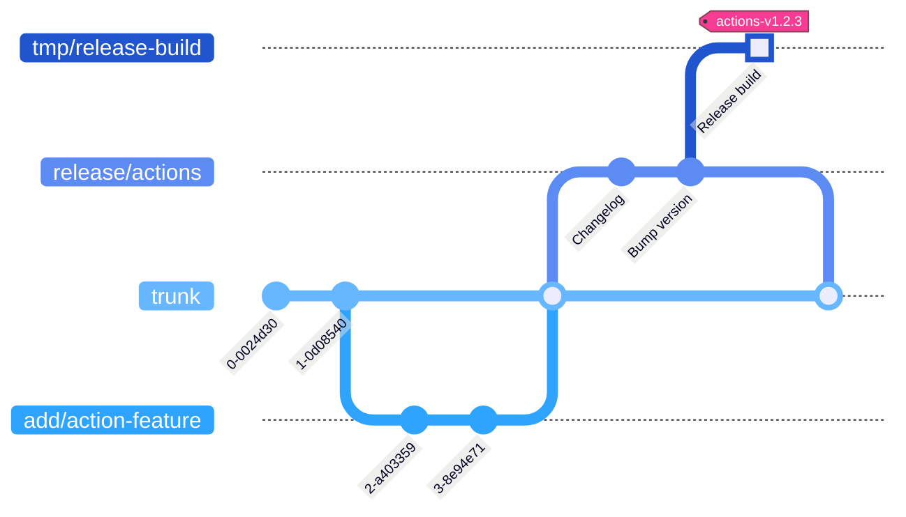

# Custom GitHub actions

[](https://github.com/woocommerce/grow/actions/workflows/github-actions-release.yml)

Custom GitHub actions that help to composite GitHub workflows across the repos maintained by the Grow Team.

## Actions list

- [`automerge-released-trunk`](actions/automerge-released-trunk) - Merge `trunk` to `develop` after an extension release
- [`branch-label`](actions/branch-label) - Set PR labels according to the branch name
- [`coverage-report`](actions/coverage-report) - Add a clover coverage report as a PR comment
- [`eslint-annotation`](actions/eslint-annotation) - Annotate eslint results via eslint formatter
- [`get-plugin-releases`](actions/get-plugin-releases) - Get latest releases versions from WordPress or from a plugin.
- [`get-release-notes`](actions/get-release-notes) - Get release notes via GitHub, infer the next version and tag
- [`hook-documentation`](actions/hook-documentation) - Generate WordPress hook documentation
- [`merge-trunk-develop-pr`](actions/merge-trunk-develop-pr) - Create a PR to merge `trunk` to `develop` after an extension release
- [`phpcs-diff`](actions/phpcs-diff) - Run PHPCS to the changed lines of code, set error annotations to a pull request
- [`prepare-extension-release`](actions/prepare-extension-release) - Create the release branch & PR with checklist
- [`prepare-mysql`](actions/prepare-mysql) - Enable MySQL, handle authentication compatibility
- [`prepare-node`](actions/prepare-node) - Set up Node.js with a specific version, load npm cache, install Node dependencies
- [`prepare-php`](actions/prepare-php) - Set up PHP with a specific version and tools, load Composer cache, install Composer dependencies
- [`publish-extension-dev-build`](actions/publish-extension-dev-build) - Publish extension development build
- [`stylelint-annotation`](actions/stylelint-annotation) - Annotate stylelint results via stylelint formatter
- [`update-version-tags`](actions/update-version-tags) - Update version tags

## Prerequisites

### JavaScript actions

1. Install `node` with version >= 14
1. Install node modules `npm i`

### PHP actions

1. Install `composer` with version >= 2
1. Run `composer install` in the action directory
1. Write tests as needed for changes to the action(s)
1. Run `composer test` to run the tests, and `composer test:coverage` to generate an HTML coverage report

## Development

### Directory structure of source code

```
/packages/github-actions/     # The root of actions
├── actions/                  # All actions to be exposed in the release build
│   ├── prepare-node/         # Composite action
│   │   ├── action.yml
│   │   └── README.md         # How to use this action
│   ├── update-version-tags/  # JavaScript action
│   │   ├── src/              # Script sources
│   │   │   ├── index.js
│   │   │   └── parse-version.js
│   │   ├── action.yml
│   │   └── README.md
│   └── hook-documentation/   # PHP action
│       ├── src/              # Script sources
│       ├── tests/            # Unit tests for the action
│       ├── coverage/         # Directory containg Code coverage report after `composer test:coverage` is run
│       ├── composer.json     # The necessary file used to identify this as a PHP action
│       └── action.yml        # The action file
├── utils/                    # Sources of the shared files
│   └── do-something.js
├── package.json              # The required dependent packages of the scripts, tests, build, and etc
└── README.md                 # The overall info about this Github actions package
```

- The `src` directories of JavaScript actions will be skipped in the release build.
- When adding a new script that needs to be built, add its build script to package.json and make sure it will be called in `npm run build`.

### Create a test build

Create a test build on the given branch and commit it to a separate branch with the `-test-build` suffix to facilitate testing and development.

1. Go to Workflow [GitHub Actions - Create Test Build](https://github.com/woocommerce/grow/actions/workflows/github-actions-create-test-build.yml)
1. Manually run the workflow with the target branch.
1. Wait for the triggered workflow run to complete.
1. View the summary of the workflow run to use the test build.
1. Take the branch name `add/my-action` and action path `greet-visitor` as an example. After a test build is created, it should be able to test the custom action by `woocommerce/grow/greet-visitor@add/my-action-test-build`
1. Delete the test branch once it is no longer needed.

### Directory structure of release build

```
/                               # Entry points for the caller repositories
├── prepare-node/
│   ├── action.yml
│   └── README.md
├── update-version-tags/
│   ├── update-version-tags.js  # Built file
│   ├── action.yml
│   └── README.md
└── README.md                   # Document prompts viewers to find the correct source code
```

The release build will be committed to a standalone point in the git tree via the release workflow, to make these custom GitHub actions have better paths and can be fetched faster.



## Release

### Official release process

1. :technologist: Create the specific branch `release/actions` onto the target revision on `trunk` branch.
1. :octocat: When the branch `release/actions` is created, will continue to commit the release content to `release/actions` branch.
   - Workflow [GitHub Actions - Prepare New Release](https://github.com/woocommerce/grow/actions/workflows/github-actions-prepare-release.yml)
   - Prepend changelog to [CHANGELOG.md](CHANGELOG.md).
   - Update versions to [package.json](package.json) and [package-lock.json](package-lock.json).
   - Creates a release PR from `release/actions` branch with `trunk` as the base branch.
1. :technologist: Check if the new changelog content and updated version are correct.
   - For a patch version like fixing bugs, increases the Z number. For example, `actions-v1.4.8`.
   - For a minor version like adding new features, increases the Y number and reset the Z to 0. For example, `actions-v1.5.0`.
   - For a major version like having incompatible changes, increases the X number and reset the Y and Z to 0. For example, `actions-v2.0.0`.
   - If something needs to be revised, append the changes in the release PR.
1. :technologist: If it's all good, approve the release PR to proceed with the next workflow.
1. :octocat: Once the release PR is approved, a workflow will create a new release with a new version tag.
   - Workflow [GitHub Actions - Create Release](https://github.com/woocommerce/grow/actions/workflows/github-actions-create-release.yml)
1. :octocat: After publishing the new release, a workflow will continue to create and commit the release build. And then update the references of the corresponding major and minor version tags onto the new release.
   - Workflow [GitHub Actions - Release](https://github.com/woocommerce/grow/actions/workflows/github-actions-release.yml)
   - When the new release version is `actions-v1.4.8`, it should update the references of `actions-v1` and `actions-v1.4` onto `actions-v1.4.8`.
   - When the new release version is `actions-v1.5.0`, it should update the reference of `actions-v1` and create `actions-v1.5` tag onto `actions-v1.5.0`.
   - When the new release version is `actions-v2.0.0`, it should create `actions-v2` and `actions-v2.0` tags onto `actions-v2.0.0`.
1. :technologist: Check if both release workflows are run successfully.
1. :technologist: Merge the release PR.

### Testing the release process

:bulb: To create a test build based on a branch, please refer to the [Create a test build](#create-a-test-build) section.

1. Create a new release with a **prerelease version tag**. For example `actions-vX.Y.Z-pre`.
1. Check if the ["GitHub Actions - Release" workflow](https://github.com/woocommerce/grow/actions/workflows/github-actions-release.yml) is run successfully.
1. Delete the testing releases and tags once they are no longer in use.

<p align="center">
	<br/><br/>
	Made with 💜 by <a href="https://woo.com/">Woo</a>.<br/>
	<a href="https://woo.com/careers/">We're hiring</a>! Come work with us!
</p>
