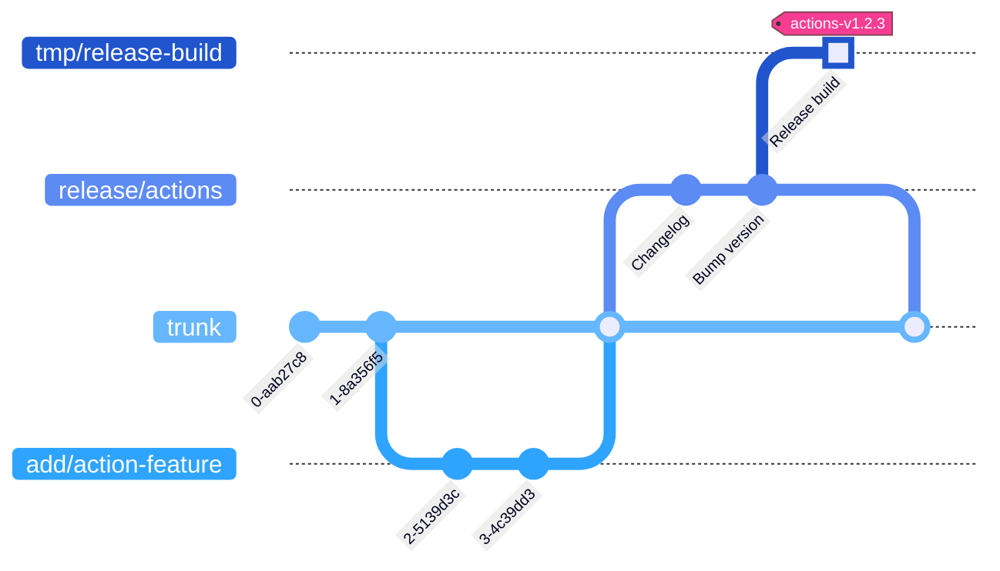

# Custom GitHub actions

[](https://github.com/woocommerce/grow/actions/workflows/github-actions-release.yml)

Custom GitHub actions that help to composite GitHub workflows across the repos maintained by the Grow Team.

## Actions list

- [`branch-label`](actions/branch-label) - Set PR labels according to the branch name
- [`coverage-report`](actions/coverage-report) - Add a clover coverage report as a PR comment
- [`eslint-annotation`](actions/eslint-annotation) - Annotate eslint results via eslint formatter
- [`get-release-notes`](actions/get-release-notes) - Get release notes via GitHub, infer the next version and tag
- [`phpcs-diff`](actions/phpcs-diff) - Run PHPCS to the changed lines of code, set error annotations to a pull request
- [`prepare-mysql`](actions/prepare-mysql) - Enable MySQL, handle authentication compatibility
- [`prepare-node`](actions/prepare-node) - Set up Node.js with a specific version, load npm cache, install Node dependencies
- [`prepare-php`](actions/prepare-php) - Set up PHP with a specific version and tools, load Composer cache, install Composer dependencies
- [`stylelint-annotation`](actions/stylelint-annotation) - Annotate stylelint results via stylelint formatter
- [`update-version-tags`](actions/update-version-tags) - Update version tags

## Prerequisites

1. Install `node` with version >= 14
1. Install node modules `npm i`

## Development

### Directory structure of source code

```
/packages/js/github-actions/  # The root of this package
├── actions/                  # All actions to be exposed in the release build
│   ├── prepare-node/         # Composite action
│   │   ├── action.yml
│   │   └── README.md         # How to use this action
│   └── update-version-tags/  # JavaScript action
│       ├── src/              # Script sources
│       │   ├── index.js
│       │   ├── parse-version.js
│       │   └── repo-tool.js
│       ├── action.yml
│       └── README.md
├── utils/                    # Sources of the shared files
│   └── do-something.js
├── package.json              # The required dependent packages of the scripts, tests, build, and etc
└── README.md                 # The overall info about this Github actions package
```

- The `src` directories will be skipped in the release build.
- When adding a new script that needs to be built, add its build script to package.json and make sure it will be called in `npm run build`.

### Directory structure of release build

```
/                               # Entry points for the caller repositories
├── prepare-node/
│   ├── action.yml
│   └── README.md
├── update-version-tags/
│   ├── update-version-tags.js  # Built file
│   ├── action.yml
│   └── README.md
└── README.md                   # Document prompts viewers to find the correct source code
```

The release build will be committed to a standalone point in the git tree via the release workflow, to make these custom GitHub actions have better paths and can be fetched faster.



## Release

### Official release

1. :technologist: Create the specific branch `release/actions` onto the target revision on `trunk` branch.
1. :octocat: When the branch `release/actions` is created, will continue to commit the release content to `release/actions` branch.
   - Workflow [GitHub Actions - Prepare New Release](https://github.com/woocommerce/grow/actions/workflows/github-actions-prepare-release.yml)
   - Prepend changelog to [CHANGELOG.md](CHANGELOG.md).
   - Update versions to [package.json](package.json) and [package-lock.json](package-lock.json).
   - Creates a release PR from `release/actions` branch with `trunk` as the base branch.
1. :technologist: Check if the new changelog content and updated version are correct.
   - For a patch version like fixing bugs, increases the Z number. For example, `actions-v1.4.8`.
   - For a minor version like adding new features, increases the Y number and reset the Z to 0. For example, `actions-v1.5.0`.
   - For a major version like having incompatible changes, increases the X number and reset the Y and Z to 0. For example, `actions-v2.0.0`.
   - If something needs to be revised, append the changes in the release PR.
1. :technologist: If it's all good, approve the release PR to proceed with the next workflow.
1. :octocat: Once the release PR is approved, a workflow will create a new release with a new version tag.
   - Workflow [GitHub Actions - Create Release](https://github.com/woocommerce/grow/actions/workflows/github-actions-create-release.yml)
1. :octocat: After publishing the new release, a workflow will continue to create and commit the release build. And then update the references of the corresponding major and minor version tags onto the new release.
   - Workflow [GitHub Actions - Release](https://github.com/woocommerce/grow/actions/workflows/github-actions-release.yml)
   - When the new release version is `actions-v1.4.8`, it should update the references of `actions-v1` and `actions-v1.4` onto `actions-v1.4.8`.
   - When the new release version is `actions-v1.5.0`, it should update the reference of `actions-v1` and create `actions-v1.5` tag onto `actions-v1.5.0`.
   - When the new release version is `actions-v2.0.0`, it should create `actions-v2` and `actions-v2.0` tags onto `actions-v2.0.0`.
1. :technologist: Check if both release workflows are run successfully.
1. :technologist: Merge the release PR.

### Testing release

1. Create a new release with a **prerelease version tag**. For example `actions-vX.Y.Z-pre`.
1. Check if the ["GitHub Actions - Release" workflow](https://github.com/woocommerce/grow/actions/workflows/github-actions-release.yml) is run successfully.
1. Delete the testing releases and tags once they are no longer in use.

<p align="center">
	<br/><br/>
	Made with 💜 by <a href="https://woocommerce.com/">WooCommerce</a>.<br/>
	<a href="https://woocommerce.com/careers/">We're hiring</a>! Come work with us!
</p>
