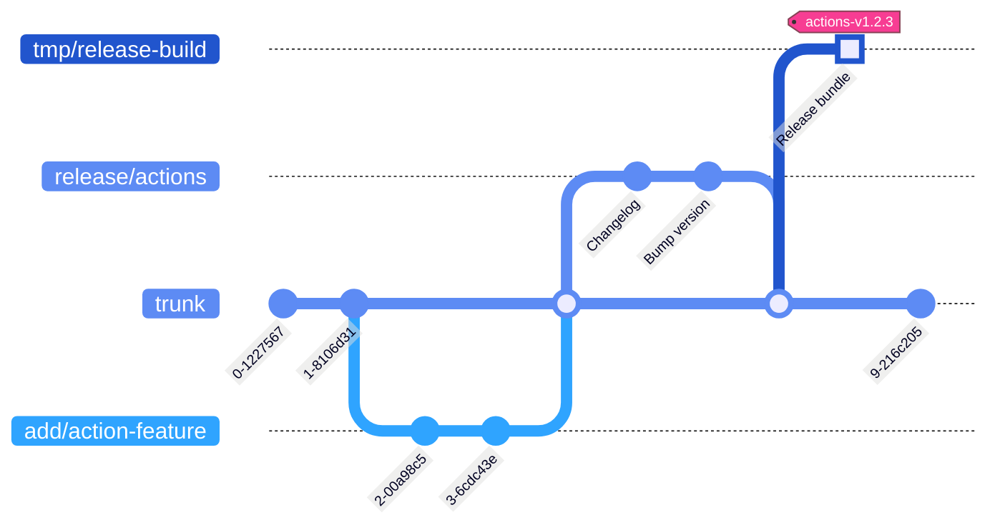

# Custom GitHub actions

[](https://github.com/woocommerce/grow/actions/workflows/github-actions-release.yml)

Custom GitHub actions that help to composite GitHub workflows across the repos maintained by the Grow Team.

## Actions list

- [`prepare-mysql`](actions/prepare-mysql) - Enable MySQL, handle authentication compatibility
- [`prepare-node`](actions/prepare-node) - Set up Node.js with a specific version, load npm cache, install Node dependencies
- [`prepare-php`](actions/prepare-php) - Set up PHP with a specific version and tools, load Composer cache, install Composer dependencies
- [`update-version-tags`](actions/update-version-tags) - Update version tags

## Prerequisites

1. Install `node` with version >= 14
1. Install node modules `npm i`

## Development

### Directory structure of source code

```
/packages/js/github-actions/  # The root of this package
├── actions/                  # All actions to be exposed in the release build
│   ├── prepare-node/         # Composite action
│   │   ├── action.yml
│   │   └── README.md         # How to use this action
│   └── update-version-tags/  # JavaScript action
│       ├── src/              # Script sources
│       │   ├── index.js
│       │   ├── parse-version.js
│       │   └── repo-tool.js
│       ├── action.yml
│       └── README.md
├── utils/                    # Sources of the shared files
│   └── do-something.js
├── package.json              # The required dependent packages of the scripts, tests, build, and etc
└── README.md                 # The overall info about this Github actions package
```

- The `src` directories will be skipped in the release build.
- When adding a new script that needs to be built, add its build script to package.json and make sure it will be called in `npm run build`.

### Directory structure of release build

```
/                               # Entry points for the caller repositories
├── prepare-node/
│   ├── action.yml
│   └── README.md
├── update-version-tags/
│   ├── update-version-tags.js  # Built file
│   ├── action.yml
│   └── README.md
└── README.md                   # Document prompts viewers to find the correct source code
```

The release build will be committed to a standalone point in the git tree via the release workflow, to make these custom GitHub actions have better paths and can be fetched faster.



## Release

### Official release

1. Find the latest version tag of GitHub actions in this repo. For example, `actions-v1.4.7`.
1. Create a new release with a new version tag that increases numerically in the format `actions-vX.Y.Z`.
   - For a patch version like fixing bugs, increases the Z number. For example, `actions-v1.4.8`.
   - For a minor version like adding new features, increases the Y number and reset the Z to 0. For example, `actions-v1.5.0`.
   - For a major version like having incompatible changes, increases the X number and reset the Y and Z to 0. For example, `actions-v2.0.0`.
1. After publishing the new release, the "GitHub Actions - Release" workflow of the GitHub Actions in this repo will continue the building and committing the bundle. And then update the references of the corresponding major and minor version tags onto the new release. For example:
   - When the new release version is `actions-v1.4.8`, it should update the references of `actions-v1` and `actions-v1.4` onto `actions-v1.4.8`.
   - When the new release version is `actions-v1.5.0`, it should update the reference of `actions-v1` and create `actions-v1.5` tag onto `actions-v1.5.0`.
   - When the new release version is `actions-v2.0.0`, it should create `actions-v2` and `actions-v2.0` tags onto `actions-v2.0.0`.
1. Check if the ["GitHub Actions - Release" workflow](https://github.com/woocommerce/grow/actions/workflows/github-actions-release.yml) is run successfully.

### Testing release

1. Basically use the same processing as the [Official release](#official-release) above, :warning: **but the format of version tag should be `actions-vX.Y.Z-pre`**.
1. Delete the testing releases and tags once they are no longer in use.

<p align="center">
	<br/><br/>
	Made with 💜 by <a href="https://woocommerce.com/">WooCommerce</a>.<br/>
	<a href="https://woocommerce.com/careers/">We're hiring</a>! Come work with us!
</p>
